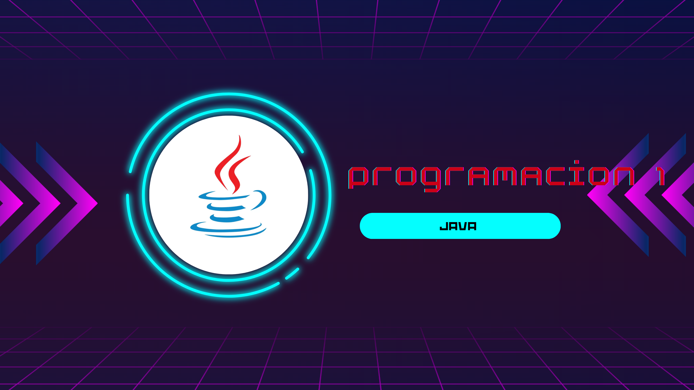
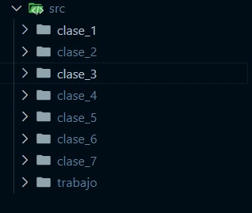

<h1>:coffee:Trabajo de programacion</h1>

  En este repositorio encontrara todo los ejemplos y ejercicios de  de programacion 1 de la universidad Fancisco de Paula Santander Ocaña, todo lo referente a los ejercicios hechos en clase y los ejercicios practicos que debemos hacer indicidualmente en el lenguaje de java

<h2>
  :top:Que encontraremos
</h2>

  Encontraremos carpetas con lo que hemos visto en cada clase y otra carpeta con los ejercicios practicos que debimos hacer extra clase  

<h2>
  📈Herramientas utilizadas
  
</h2>

<h2>
  ✒️autor
</h2>

-Juan José Zambrano Manzano - 192327

